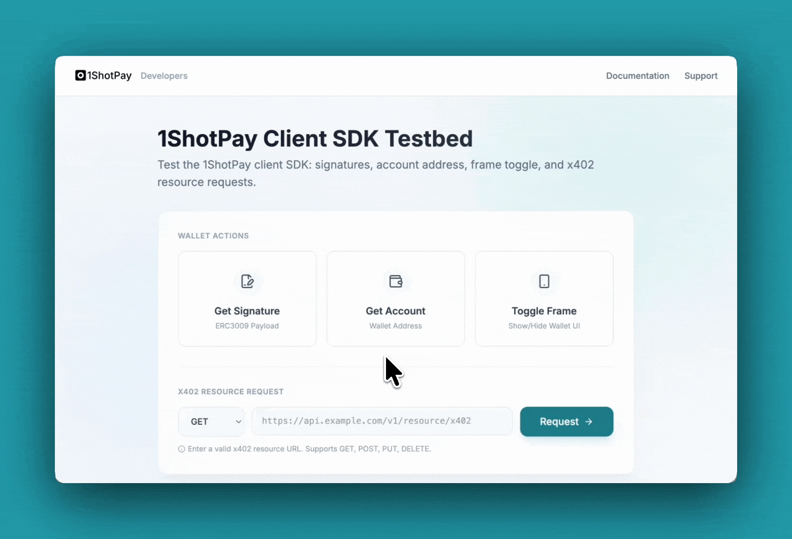

Client-Side / iFrame Integration
================================

.. raw:: html

    

The client SDK lets you embed the **1ShotPay stablecoin wallet** in your site via an iframe. When a user clicks a button (for example, "Pay with 1ShotPay"), a card opens and gives them the choice to approve or reject the payment—all without leaving your page. 

There are two key payments types:

- **Transfer with Authorization:** The 1ShotPay wallet returns a signed EIP-3009 payload to the caller for relaying to the Base network.
- **x402 Fetch:** The caller can request a call to an x402-compatible API endpoint in which the 1ShotPay wallet will handle calling the endpoint from the iframe context.

Install
-------

.. code-block:: bash

   yarn add @1shotapi/1shotpay-client-sdk @1shotapi/1shotpay-common

Import shared types (e.g. ``BigNumberString``, ``ELocale``, ``EVMAccountAddress``, ``UnixTimestamp``) from ``@1shotapi/1shotpay-common`` when you need them.

Quick start
-----------

.. code-block:: typescript

   import { OneShotPayClient } from "@1shotapi/1shotpay-client-sdk";
   import {
     BigNumberString,
     ELocale,
     EVMAccountAddress,
     UnixTimestamp,
   } from "@1shotapi/1shotpay-common";

   const wallet = new OneShotPayClient();

   await wallet.initialize("Wallet", [], ELocale.English).match(
     () => undefined,
     (err) => {
       throw err;
     },
   );

   wallet.show();
   wallet.hide();

   const result = await wallet
     .getERC3009Signature(
       "Some recipient",
       EVMAccountAddress("0x..."),
       BigNumberString("1"),
       UnixTimestamp(1715222400),
       UnixTimestamp(1715222400),
     )
     .match(
       (ok) => ok,
       (err) => {
         throw err;
       },
     );

API overview
------------

**OneShotPayClient** is the main class. Key methods:

- **Lifecycle:** ``initialize()``, ``getStatus()``
- **Auth:** ``signIn()``, ``signOut()``
- **Account:** ``getAccountAddress()``
- **Signatures:** ``getERC3009Signature()``, ``getPermitSignature()``
- **HTTP:** ``x402Fetch()``
- **Visibility:** ``show()``, ``hide()``, ``getVisible()``

Visibility
----------

- ``show()`` / ``hide()`` control the iframe modal (the payment card).
- ``getVisible()`` returns whether the modal is currently shown.

Use ``show()`` when the user clicks your "Pay with 1ShotPay" (or similar) button; use ``hide()`` when closing the UI or after the flow completes.

Iframe events
-------------

Listen for these events from the embedded iframe:

- ``closeFrame`` — The user closed the UI.
- ``registrationRequired`` — Open the registration URL in a new tab so the user can sign up for 1ShotPay.

See also
--------

- **Testbed:** Try the embedded 1ShotPay functionality at the `client SDK testbed <https://client-sdk-testbed.1shotpay.com/>`_.
- **Example app:** See client-side checkout in the `402xPress <https://402xpress.com>`_ demo.
