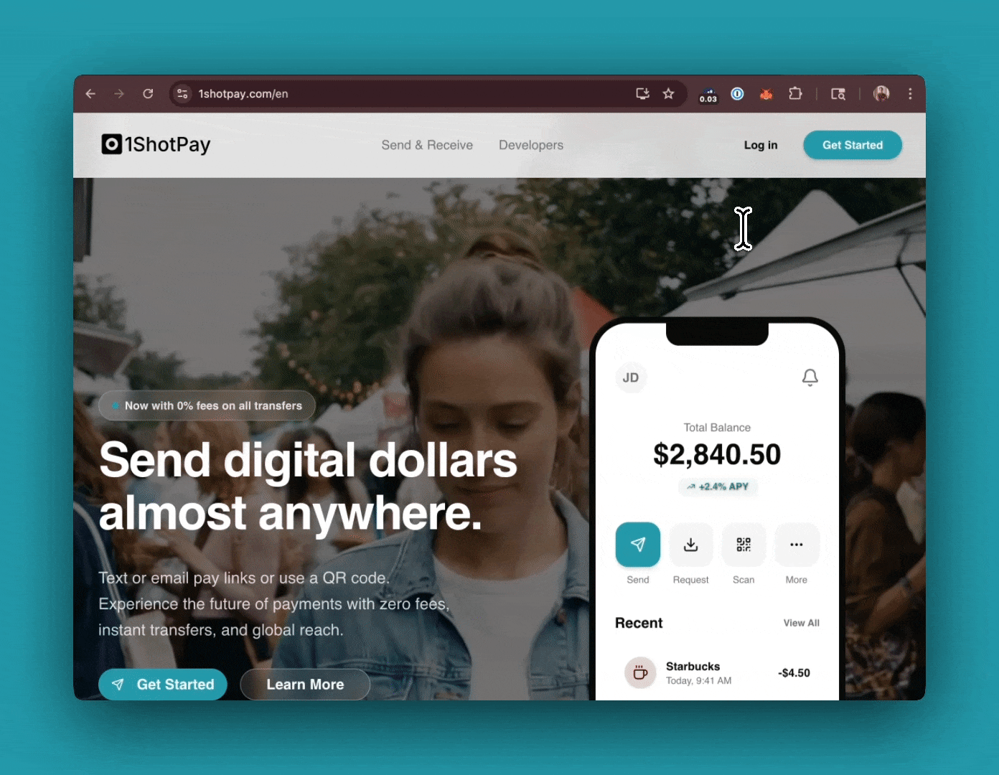

1ShotPay
===========

1ShotPay is a fully non-custodial consumer stablecoin wallet. It is fully web-based and does not require downloading an app or installing any software. You can create a free account at `1shotpay.com <https://1shotpay.com>`_.

There is no KYC or AML required to use 1ShotPay. Sign up on mobile or desktop in a few seconds by claiming a unique username and optionally backing up your account. You can fund your account from your USDC balance on Base network using any external Ethereum-compatible wallet. Alternatively, you can onramp from a debit card, Apple Pay or bank transfer with Coinbase Onramp by clicking the "Deposit" button on the home screen.

Use Cases
---------

Any web application (including onchain apps built on 1Shot API) can leverage 1ShotPay as a meta-onboarding provider to enable users to sign up, fund accounts, checkout or pay for services without the need for expensive payment processors or waiting to get approved by onramp providers. Some key use cases include:

- Cart checkout
- QR code payments
- Subscription payments
- In-app micro-transactions
- Agent Allowances for `x402 </x402/index.html>`_ tool calls

Device Requirements
-------------------

.. raw:: html

    

1ShotPay uses browser-based passkeys to secure user accounts. This means that it must be accessed in a passkey-enabled browser like Chrome, Firefox, Safari, etc. Webviews typically do not support passkey functionality. Additionally, the WebAuthn `prf-extension <https://developer.mozilla.org/en-US/docs/Web/API/Web_Authentication_API/WebAuthn_extensions#prf>`_ must be available as it is required for key derivation. 

Testing and Integration
------------------------

You can test the embedded functionality of 1ShotPay on the `testbed page <https://client-sdk-testbed.1shotpay.com/>`_. Additionally, you can see an example integration of client-side checkout with 1ShotPay in the `402xPress <https://402xpress.com>`_ demo app. 

See the details for client-side, iframe-based integration or server-side, pay link-based integration:

.. grid:: 2
    :gutter: 2

    .. grid-item-card:: 1. Client-Side/iFrame Integration
        :link: /1shotpay/client.html
        :link-alt: Client-side integration with 1ShotPay
        :columns: 6

        Request payments from users directly in your application.

    .. grid-item-card:: 2. Server-Side Pay Link Checkout
        :link: /1shotpay/server.html
        :link-alt: Server-side integration with 1ShotPay
        :columns: 6

        Redirect users to a pay link checkout page to complete the payment.

.. toctree::
   :maxdepth: 2

   client
   server