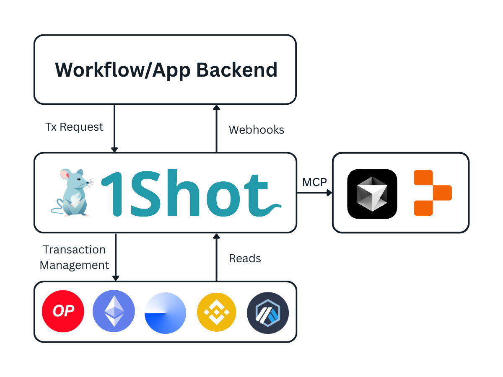
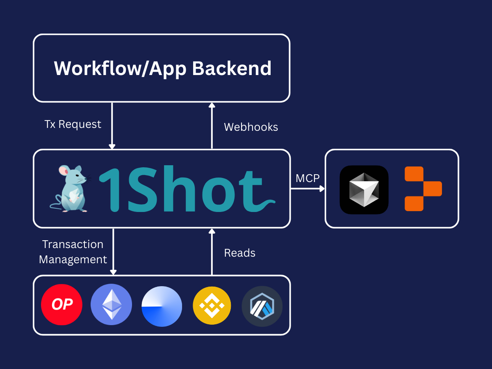

.. 1shot-documentation documentation master file, created by
   sphinx-quickstart on Wed Feb 12 19:54:45 2025.
   You can adapt this file completely to your liking, but it should at least
   contain the root `toctree` directive.

.. image:: ./_static/welcome-banner-light.png
   :alt: 1Shot API welcome banner (light theme)
   :align: center
   :class: only-light

.. image:: ./_static/welcome-banner-dark.png
   :alt: 1Shot API welcome banner (dark theme)
   :align: center
   :class: only-dark

.. raw:: html

    

Welcome to 1Shot API
====================

..  youtube:: qsawSR3tOSs
   :align: center

.. raw:: html

    

`1Shot API <https://1shotapi.com>`_ is a full-stack web3 infrastructure platform that lets you bring reliable onchain agents, workflows and products to market fast with account abstraction, server wallets and consumer stablecoin payments. 1Shot API offers MCP capabilities to connect to the most popular agentic coding tools like Cursor or Replit to prompt your way to a production-ready onchain application or agent.

The fastest way to get started is to connect the `1Shot Prompts </prompts/index.html>`_ MCP server to your favorite agentic development environment like Cursor or Replit. The agentic coding environment will handle setting up server wallets and importing the necessary smart contract methods into your account.

Getting Started
----------------------------------

Start by creating a free `1Shot API account <https://app.1shotapi.com>`_. Next, explore the paths to get you up and running with the 1Shot API:

.. grid:: 2
    :gutter: 2

    .. grid-item-card:: 1. Manual Setup 💻
        :link: /basics/index.html
        :link-alt: How to manually set up your 1Shot API account.
        :columns: 4

    .. grid-item-card:: 2. AI-Driven Setup 🤖
        :link: /prompts/index.html
        :link-alt: Using the 1Shot Prompts MCP server to set up your 1Shot API account.
        :columns: 4

    .. grid-item-card:: 3. Stablecoin Payments 💰💳
        :link: /1shotpay/index.html
        :link-alt: Integrating 1ShotPay
        :columns: 4

How It Works
------------

.. raw:: html

    

1Shot API is not an RPC provider, it is a customizable transaction relayer service which handles the full transaction lifecycle with real-time webhook callbacks on the final state of your application's transactions. 1Shot API allows you to read from and write to smart contracts without needing to import web3 clients or smart contract ABIs into your source code. This lets you keep your workflows and application logic simple and focused on your product's unique value proposition.

The 1Shot API service is designed to handle heavy request traffic. If your product has many users generating onchain actions all at once, 1Shot API ensures all of your transactions will make it to the chain quickly and gas efficiently without flooding the mempool. 1Shot API greatly simplifies the technical overhead of adding digital assets or on-chain logic to any application, bot, or agent, regardless of the language your application is written in. Additionally, with its powerful team & role management features, 1Shot API can scale with your product as your team and user base grows from proof-of-concept to enterprise scale.

Several helpful client SDKs for popular languages like `Python <https://pypi.org/project/uxly-1shot-client/>`_, `Typescript <https://www.npmjs.com/package/@uxly/1shot-client>`_ are available so you can one shot your next app in no time, leaving the complexities of delegation, transaction batching, submission and monitoring to us.

.. toctree::
   :hidden:
   :maxdepth: 2

   basics/index.rst
   1shotpay/index.rst
   prompts/index.rst
   x402/index.rst
   automation/index.rst
   api/index.rst
